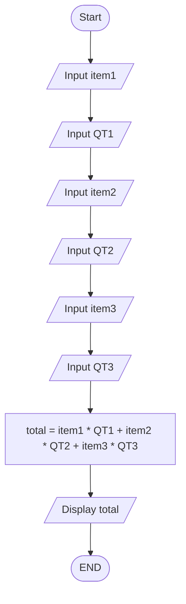

```mermaid
flowchart TD
    A([Start]) --> B[/Input item1/]
    B --> C[/Input QT1/]
    C --> D[/Input item2/]
    D --> E[/Input QT2/]
    E --> F[/Input item3/]
    F --> G[/Input QT3/]
    G --> H[total = item1 * QT1 + item2 * QT2 + item3 * QT3]
    H --> I[/Display total/]
    I --> J([END])
```