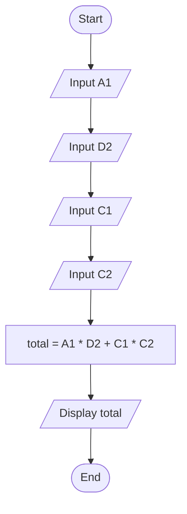

```mermaid
flowchart TD
    A([Start]) --> B[/Input A1/]
    B --> C[/Input D2/]
    C --> D[/Input C1/]
    D --> E[/Input C2/]
    E --> F[total = A1 * D2 + C1 * C2]
    F --> G[/Display total/]
    G --> H([End])
```