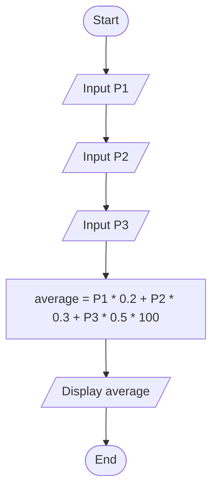

```mermaid
flowchart TD
    A([Start]) --> B[/Input P1/]
    B --> C[/Input P2/]
    C --> D[/Input P3/]
    D --> E[average = P1 * 0.2 + P2 * 0.3 + P3 * 0.5 * 100]
    E --> F[/Display average/]
    F --> G([End])
```