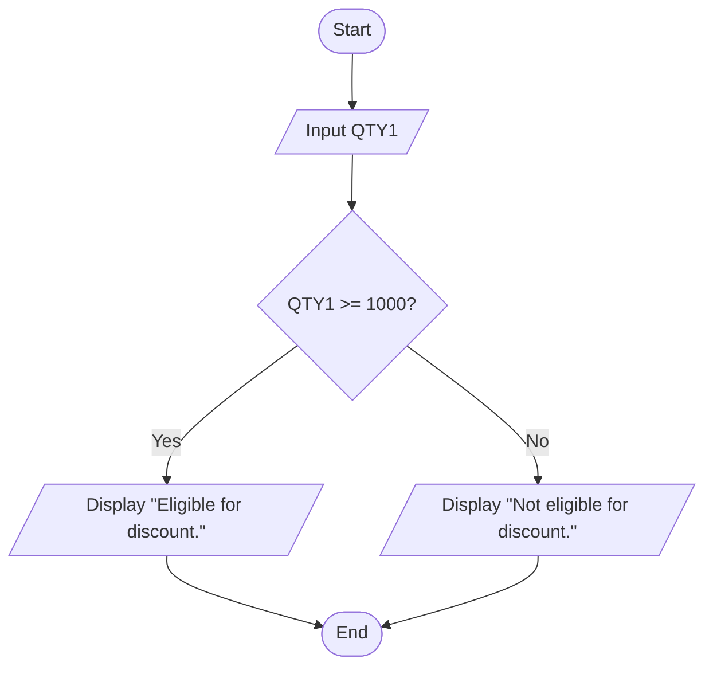

```mermaid
flowchart TD
    A([Start]) --> B[/Input QTY1/]
    B --> C{QTY1 >= 1000?}
    C -- Yes --> D[/Display "Eligible for discount."/]
    C -- No --> E[/Display "Not eligible for discount."/]
    D --> F([End])
    E --> F
```