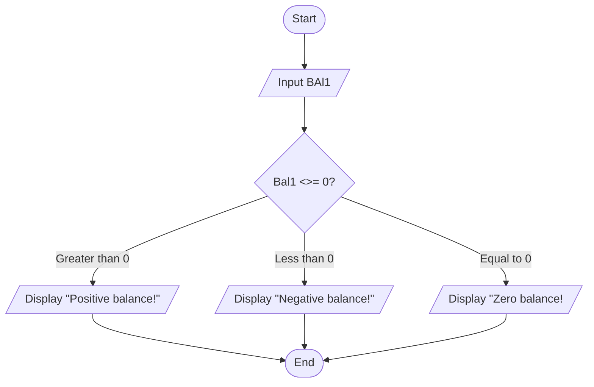

```mermaid
flowchart TD
    A([Start]) --> B[/Input BAl1/]
    B --> C{Bal1 <>= 0?}
    C -- Greater than 0 --> D[/Display "Positive balance!"/]
    C -- Less than 0 --> E[/Display "Negative balance!"/]
    C -- Equal to 0 --> F[/Display "Zero balance!/]
    D --> G([End])
    E --> G
    F --> G
```